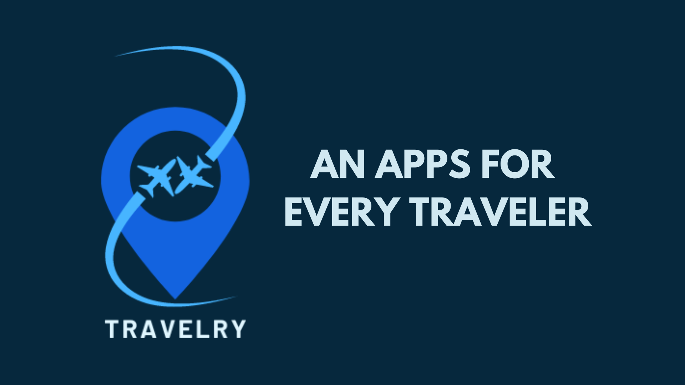
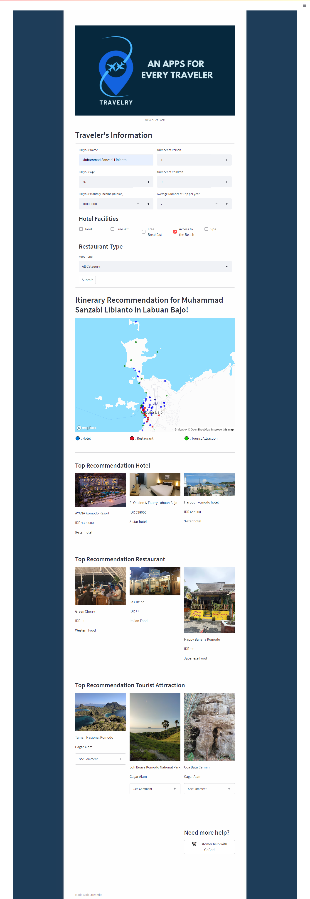
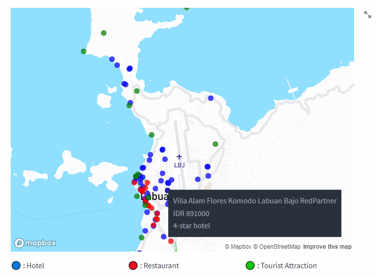
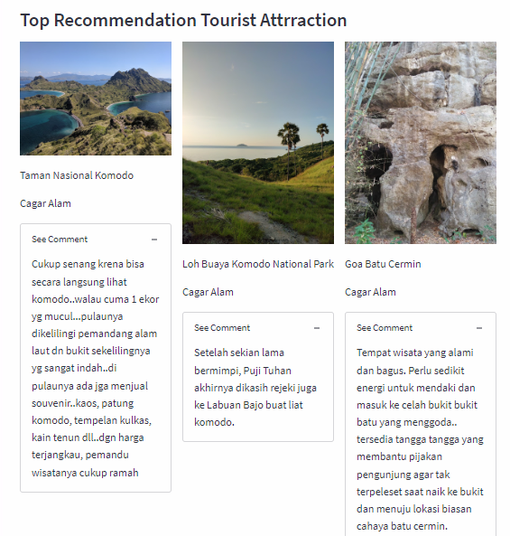
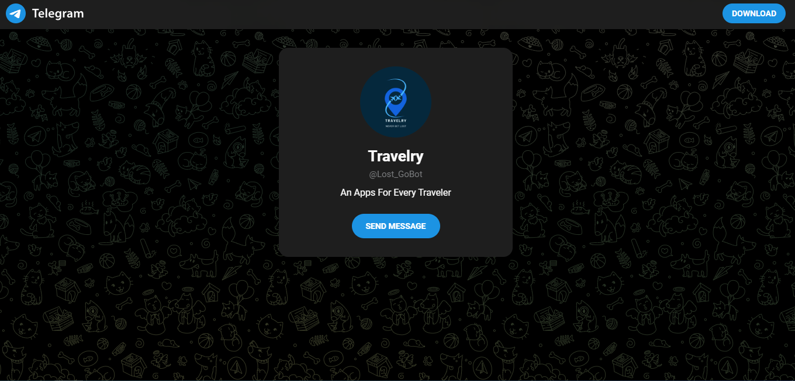

# Hi there, Welcome to ours Final Projects👋

## About the projects!🖥️ 

**Travelry (Online Travel Agency)**

Travelry merupakan sebuah aplikasi yang dapat memberikan sebuah rekomendasi Itinerary liburan yang menarik. Dimulai dari rekomendasi Hotel, Kuliner, dan tempat Wisata terbaik berdasarkan kategori dari para pengguna aplikasi ini.

# Deployment : 

We deploy the application through Heroku, don't hesitate to try it and please give us your feedback!

- [Heroku](https://travelry-apps.herokuapp.com/)
- [Feedback](https://forms.gle/Y6JJT9pJJeSPNPu99)

Some screenshot of Travelry Application:

**Full page of the apps:**

**Interactive Map**

**Comments Sections**

**Bot Helper on Telegram**

## Meet the team! 🔥

**Hacktiv8 - Group 5 - Batch 11**

- Nirwan Arrachman

&nbsp;&nbsp;

- R. Fadli Syauqi

&nbsp;&nbsp;

- Muhammad Sanzabi Libianto

&nbsp;&nbsp;
